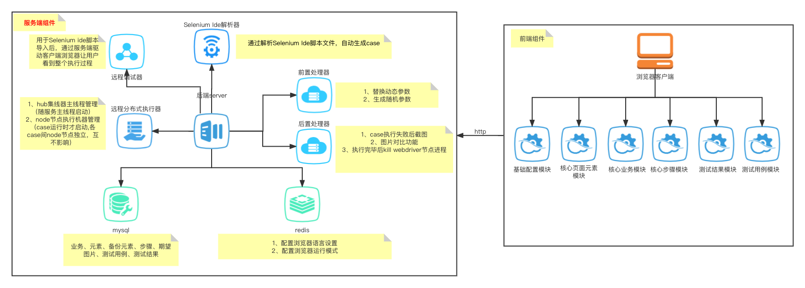
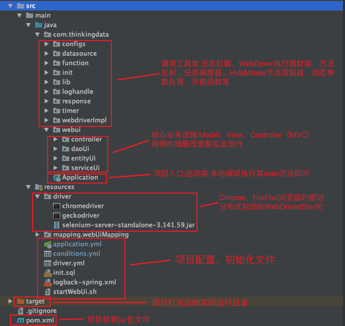
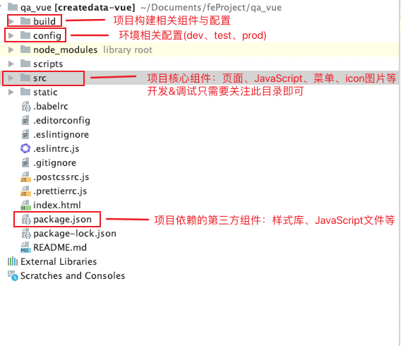

## 一、UI自动化面临的痛点
##### &emsp;&emsp;1.维护case耗时较长，需要在页面上手动找元素，脚本形式运行配置较多，无法校验是否配置正确性，需要一定的代码基础，上手难度较高。
##### &emsp;&emsp;2.易用性较差，通常以代码命名的模块无法做到见名知义，需要一段时间来熟悉项目，没有模块化和结构化的概念，只能做到小团队内推广使用，对外输出能力较弱，无法对其他团队如开发、产品进行推广。
##### &emsp;&emsp;3.对于case的长期积累不利，以文件形式存储case、配置、参数等信息，case量起来后，项目会越来越大，对于case的动态查找不方便。
##### &emsp;&emsp;4.后期拓展空间不大，若需要实现某些定制化的功能，如：对测试报告进行处理，需要重新开发对应的报告模板、case结果数据结构需要重构，可能需要对框架本身需要重构。

## 二、解决方案
##### &emsp;&emsp;1.针对case的维护问题，从整个ui自动化的特性出发，本身是基于页面操作的流程回放，一个case就是一个完整的业务流程，case内部是各个页面元素的操作集合，所以基于这种形式，就可以通过浏览器插件(Selenium Ide)录制的方式来生成ui自动化的case，回放成功后，导入系统会自动解析成我需要的数据对象。
##### &emsp;&emsp;2.针对case的易用性、长期积累、后期拓展，解决办法是将框架web化，case原始数据持久化（入库处理）统一维护入口，使用人群不局限于测试团队，会开放给开发、产品团队使用。

## 三、架构图

## 四、后端项目简介
- ##### 开发语言&框架：Java+Maven+SpringBoot+Mybatis+Mysql+Redis(java版本>=1.8)
- ##### 项目各目录简介：

- ##### 本地运行:
###### &emsp;&emsp;直接运行Application类的main方法即可
###### &emsp;&emsp;后端地址:http://127.0.0.1:9998/webui

- ##### jar包运行
###### &emsp;&emsp;打包:maven clean install
###### &emsp;&emsp;运行:java -jar WebUiAutomation.jar
###### &emsp;&emsp;后端地址:http://127.0.0.1:9998/webui

## 五、前端项目简介
- ##### 开发语言&框架：JavaScript+Html+Css+Vue.js+Element-Ui+Node.js+Webpack
- ##### 源码地址:https://github.com/fernandozw/qa-vue.git
- ##### 项目各目录简介:

### 构建&运行

- ##### 安装依赖
###### &emsp;&emsp;1. npm install(官方默认安装方式,速度比较慢,建议使用后两种)
###### &emsp;&emsp;2. 或者指定国内镜像安装:npm install --registry=https://registry.npm.taobao.org
###### &emsp;&emsp;3. 或者通过cnpm install （前提是需要安装cnpm：npm install cnpm --registry=https://registry.npm.taobao.org）

- ##### 开发环境运行
###### &emsp;&emsp;命令:npm run dev

- ##### 生产环境构建
###### &emsp;&emsp;命令:npm run build

- ##### 生产构建并查看报告
###### &emsp;&emsp;命令:npm run build --report

##### 注意事项
###### &emsp;&emsp;1. package.json中dependencies不要使用^xxx版本的方式指定版本,一旦有新版本发布,会有兼容性问题产生("^"是使用更高版本,不要"^"是使用固定版本,建议各个依赖都是固定版本)
###### &emsp;&emsp;2. 项目是vue2.x,安装时不要弄错vue版本

